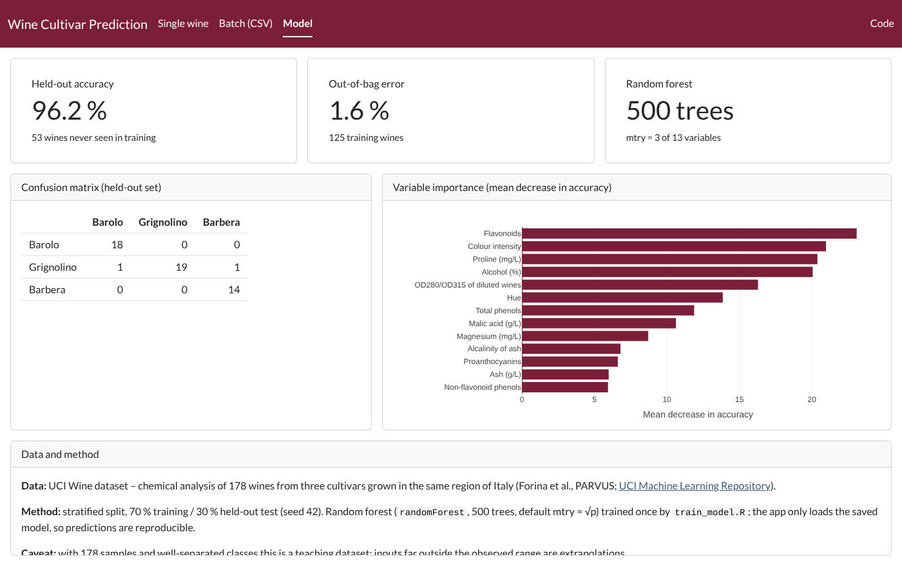
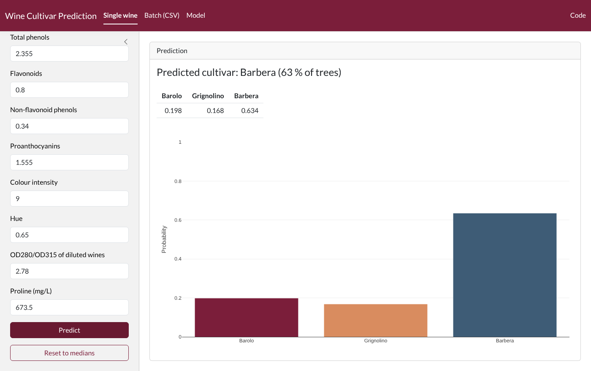
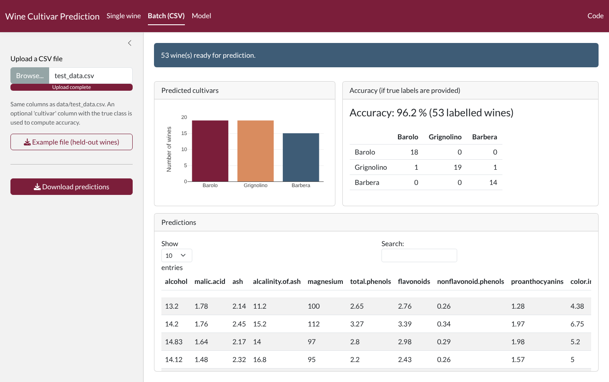

# Wine Cultivar Prediction – R Shiny app

[](https://github.com/youcef-benmohammed/wine-classification-app/actions/workflows/tests.yml)
[](LICENSE)

A Shiny app that predicts the cultivar of an Italian wine (Barolo, Grignolino or Barbera) from 13
chemical measurements with a random forest. You can enter one wine by hand or upload a CSV file. The
app also shows how the model was evaluated.

**Live app:** https://5lhxiz-youcef-ben0mohammed.shinyapps.io/wine_classification_shiny-main/
(free hosting: the first load can take 20–30 s)



## Features

| Tab | What it does |
|---|---|
| **Single wine** | 13 inputs, preset to the dataset medians and limited to the observed range. Returns the predicted cultivar and the class probabilities. |
| **Batch (CSV)** | Validates the file: missing columns, non-numeric values, NAs, values far outside the observed range. Returns predictions, a downloadable CSV, and accuracy plus a confusion matrix when a `cultivar` column is present. |
| **Model** | Held-out accuracy, out-of-bag error, confusion matrix, variable importance, data source and method. |

## Data and method

- **Data:** [UCI Wine dataset](https://archive.ics.uci.edu/dataset/109/wine). It contains 178 wines from three cultivars grown in the same region of Italy (Forina et al., PARVUS), with 13 chemical measurements each.
- **Split:** stratified, 70 % training (125 wines) and 30 % held-out test (53 wines), seed 42.
  `data/test_data.csv` contains only the held-out wines, with their true cultivar.
- **Model:** `randomForest` with 500 trees and the default `mtry` (√13 ≈ 3), trained once by
  [`train_model.R`](train_model.R). The app only loads `model/wine_model.rds`, so predictions are
  reproducible.

| Metric | Value |
|---|---|
| Out-of-bag error (training set) | 1.6 % |
| Accuracy on the 53 held-out wines | 96.2 % (2 errors, both on Grignolino) |

This is a small, well-separated teaching dataset. The project is meant to show a clean modelling
workflow and a clean app, not a hard prediction problem.

| Single wine | Batch prediction |
|---|---|
|  |  |

## Run locally

```bash
git clone https://github.com/youcef-benmohammed/wine-classification-app.git
cd wine-classification-app
conda env create -f environment.yml && conda activate wine-shiny   # or install the packages below
Rscript -e 'shiny::runApp(".")'
```

R packages: `shiny`, `bslib`, `plotly`, `DT`, `randomForest` (plus `testthat` for the tests).

Retrain the model, which regenerates `model/` and `data/test_data.csv`:

```bash
Rscript train_model.R
```

Run the tests:

```bash
Rscript tests/testthat.R
```

## Deploy (shinyapps.io)

```r
rsconnect::deployApp(appName = "wine_classification_shiny-main",
                     appFiles = c("app.R", "R", "model", "data"))
```

## Project structure

```
├── app.R               # Shiny app (loads the saved model)
├── train_model.R       # split, training, evaluation -> model/, data/test_data.csv
├── R/wine.R            # shared functions (data, split, training, validation, prediction)
├── model/              # wine_model.rds + metrics.rds
├── data/               # wine.data.csv (UCI), test_data.csv (held-out wines)
├── tests/              # testthat unit tests (run in GitHub Actions)
└── CHANGELOG.md        # changes between versions (v0.1 -> v0.2)
```

## License

MIT, see [LICENSE](LICENSE).
